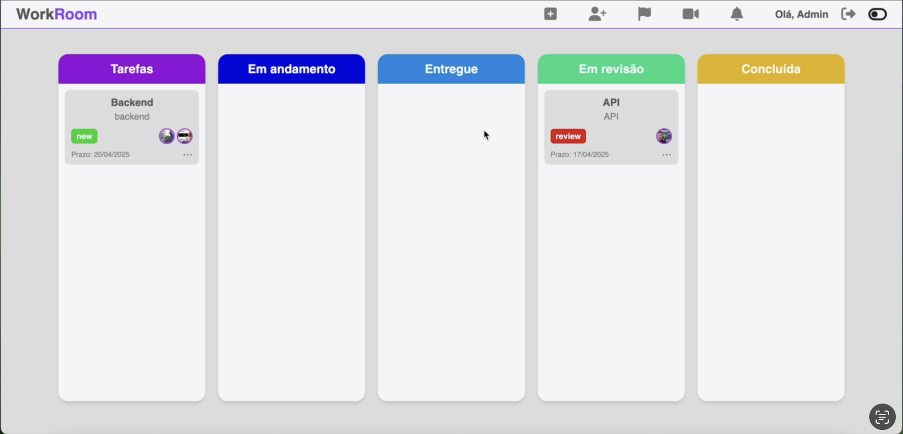

# Kanban Workroom  



O **Kanban Workroom** foi desenvolvido para aprimorar a **organização de tarefas**, permitindo uma gestão eficiente e colaborativa em equipe. Ele é uma aplicação **fullstack**, combinando tecnologias modernas para oferecer uma experiência fluida e escalável.  

## Tecnologias Utilizadas  

### **Frontend**  
- HTML, CSS, JavaScript  

### **Backend**  
- Node.js (TypeScript)  
- MongoDB  
- Docker  

## Funcionalidades Principais  

- **Kanban Interativo** : Arraste e solte tarefas entre diferentes etapas do fluxo de trabalho.  
- **Gestão de Tarefas** : Títulos, descrições, tags, prazo e fotos dos responsáveis.  
- **Sistema de Revisão** : Usuários movem tarefas até "Entregue", enquanto o **Admin** define se ela passa para "Em Revisão" ou retorna para ajustes.  
- **Controle de Usuários** : Apenas o **Admin** pode cadastrar novos usuários e fornecer acesso ao sistema.  
- **Salas de Reunião** : Acesso rápido a reuniões diretamente pelo sistema.  
- **Notificações em Tempo Real** : Os usuários recebem alertas automáticos sobre mudanças nas tarefas.  
- **Modo Claro/Escuro** : Personalização do tema para melhor experiência visual.  

## Fluxo de Tarefas no Kanban  

1️⃣ **Criação da Tarefa** – O administrador adiciona uma nova atividade ao sistema.  
2️⃣ **Movimentação pelo Usuário** – A tarefa pode avançar até "Entregue".  
3️⃣ **Revisão pelo Admin** – O administrador revisa e decide:  
   - Se estiver correta, move para **Concluída** .  
   - Se precisar ajustes, volta para "Tarefa" com a tag **Revisão** .  

## Documentação da API  

A API do **Kanban Workroom** é documentada com **Swagger**, permitindo testes e acesso simplificado aos endpoints diretamente pelo navegador.  

🔗 **Swagger UI**: [URL da Documentação]  

### **Exemplo de Requisição**  

```json
[
  {
      "_id": "67f3bfe2df1bbe3323a4c239",
      "title": "API",
      "description": "API",
      "delivery_date": "2025-04-17T00:00:00.000Z",
      "status": "done",
      "assigned_users": [
          {
              "_id": "67f01010a1e430c54e41b934",
              "profilePicture": "https://t4.ftcdn.net/jpg/05/40/62/43/360_F_540624331_koFaCm57r3X4Vi7wdGmtthrw5oB0H6Ye.jpg",
              "name": "Sin Blue",
              "email": "sin@example.com",
              "role": {
                  "_id": "67effc9a03d5be23e0b9ec75",
                  "name": "developer",
                  "createdAt": "2025-04-04T15:36:58.007Z",
                  "updatedAt": "2025-04-04T15:36:58.007Z"
              }
          }
      ],
      "createdAt": "2025-04-07T12:06:58.215Z",
      "updatedAt": "2025-04-07T12:08:41.333Z"
  },
  {
      "_id": "67f3c003df1bbe3323a4c251",
      "title": "Backend",
      "description": "backend",
      "delivery_date": "2025-04-20T00:00:00.000Z",
      "status": "new",
      "assigned_users": [
          {
              "_id": "67effcab03d5be23e0b9ec7c",
              "profilePicture": "https://img.freepik.com/fotos-premium/retrato-de-homem-negro-como-programador-de-computador-olhando-para-a-camera-enquanto-escrevia-codigo-no-local-de-trabalho-do-escritorio_236854-44721.jpg",
              "name": "Dan Brown",
              "email": "dan@example.com",
              "role": {
                  "_id": "67effc9d03d5be23e0b9ec78",
                  "name": "manager",
                  "createdAt": "2025-04-04T15:37:01.845Z",
                  "updatedAt": "2025-04-04T15:37:01.845Z"
              }
          },
          {
              "_id": "67f00503df5c5bf5c64593e3",
              "profilePicture": "https://as2.ftcdn.net/jpg/04/37/51/95/1000_F_437519505_L2bQf3BgHdgHINJT3OxU2ahsMpmUZgel.jpg",
              "name": "Lina Yellow",
              "email": "lina@example.com",
              "role": {
                  "_id": "67effc9a03d5be23e0b9ec75",
                  "name": "developer",
                  "createdAt": "2025-04-04T15:36:58.007Z",
                  "updatedAt": "2025-04-04T15:36:58.007Z"
              }
          }
      ],
      "createdAt": "2025-04-07T12:07:31.926Z",
      "updatedAt": "2025-04-07T12:07:31.926Z"
  }
]
```

## Clone o repositório

git clone
cd kanban-workroom

## Instale as dependências
npm install

## Configure o banco de dados (MongoDB)
### Certifique-se de que o MongoDB esteja rodando localmente ou defina uma conexão externa.

## Inicie o projeto
npm run dev
